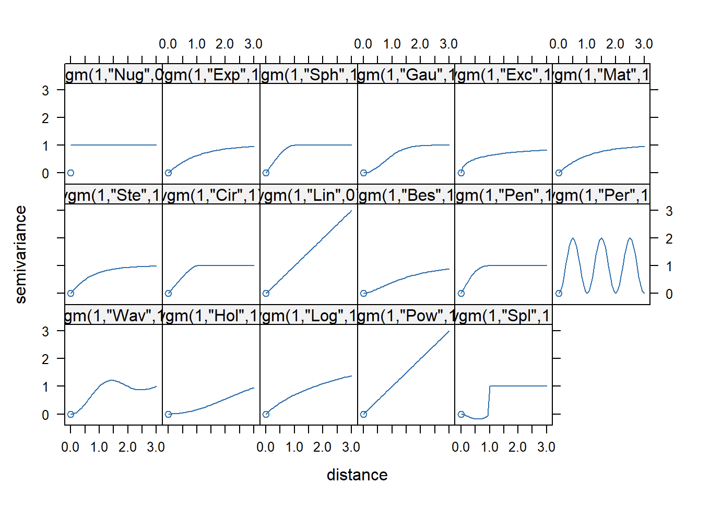

In order to prepare an isohyet map, spatial interpolation will be used. Spatial interpolation is the process of using points with known values to estimate values at other unknown points. For example, to make a rainfall above, we will not find enough evenly spread weather stations to cover the entire region. Spatial interpolation can estimate the rainfall at locations without recorded data by using known rainfall readings at nearby weather stations

# 1 Load the Packages

```{r}
pacman::p_load(sf, terra, gstat, automap,
               tmap, viridis, tidyverse)
```

# 2 The Data

Stations with latitude and longitude

```{r}
rfstations <- read_csv("data/aspatial/RainfallStation.csv")
```

Monthly rain fall for each station

```{r}
rfdata <- read_csv("data/aspatial/DAILYDATA_202402.csv") %>%
  select(c(1, 5)) %>%
  group_by(Station) %>%
  summarise(MONTHSUM = sum(`Daily Rainfall Total (mm)`)) %>%
  ungroup()
```

### **Converting aspatial data into geospatial data**

```{r}
rfdata <- rfdata %>%
  left_join(rfstations)
```

`st_as_sf()` of **sf** package is used to convert *rfdata* into a simple feature data.frame object called *rfdata_sf*.

```{r}
rfdata_sf <- st_as_sf(rfdata, 
                      coords = c("Longitude",
                                 "Latitude"),
                      crs= 4326) %>%
  st_transform(crs = 3414)
```

### **Importing planning subzone boundary data**

```{r}
mpsz2019 <- st_read(dsn = "data/geospatial", 
                    layer = "MPSZ-2019") %>%
  st_transform(crs = 3414)
```

### **Visualising the data prepared**

```{r}
tm_check_fix()
tmap_mode("view")
tm_shape(mpsz2019) +
  tm_borders() +
tm_shape(rfdata_sf) +
  tm_dots(fill = 'MONTHSUM')
```

```{r}
tmap_mode("plot")
```

# **3 Spatial Interpolation: gstat method**

-   No variogram model → IDW

-   Variogram model, no covariates → Ordinary Kriging

-   Variogram model, with covariates → Universal Kriging

### **Data preparation**

We need create a grid data object by using `rast()` of **terra** package as shown in the cod chunk below.

```{r}
grid <- terra::rast(mpsz2019, 
                    nrows = 690, 
                    ncols = 1075)
grid
```

Next, a list called xy will be created by using `xyFromCell()` of **terra** package.

```{r}
xy <- terra::xyFromCell(grid, 
                        1:ncell(grid))
head(xy)
```

We will create a data frame called *coop* with prediction/simulation locations by using the code chunk below.

```{r}
coop <- st_as_sf(as.data.frame(xy), 
                 coords = c("x", "y"),
                 crs = st_crs(mpsz2019))
coop <- st_filter(coop, mpsz2019)
head(coop)
```

# **4 Inverse Distance Weighted (IDW)**

Weighting is assigned to sample points through the use of a weighting coefficient that controls how the weighting influence will drop off as the distance from new point increases. The greater the weighting coefficient, the less the effect points will have if they are far from the unknown point during the interpolation process. As the coefficient increases, the value of the unknown point approaches the value of the nearest observational point.

```{r}
res <- gstat(formula = MONTHSUM ~ 1, 
             locations = rfdata_sf, 
             nmax = 5,
             set = list(idp = 0))
```

Now that our model is defined, we can use `predict()` to actually interpolate, i.e., to calculate predicted values. The predict function accepts:

-   A raster—stars object, such as dem

-   A model—gstat object, such as g

The raster serves for two purposes:

-   Specifying the locations where we want to make predictions (in all methods), and

-   Specifying covariate values (in Universal Kriging only).

```{r}
resp <- predict(res, coop)
```

```{r}
resp$x <- st_coordinates(resp)[,1]
resp$y <- st_coordinates(resp)[,2]
resp$pred <- resp$var1.pred

pred <- terra::rasterize(resp, grid, 
                         field = "pred", 
                         fun = "mean")
```

### **Mapping the interpolated rainfall raster**

```{r}
tm_check_fix()
tmap_mode("plot")
tm_shape(pred) + 
  tm_raster(col_alpha = 0.6, 
            col.scale = tm_scale(
              values = "brewer.blues"))
```

# **5 Kriging**

Kriging is one of several methods that use a limited set of sampled data points to estimate the value of a variable over a continuous spatial field. An example of a value that varies across a random spatial field might be total monthly rainfall over Singapore. It differs from Inverse Distance Weighted Interpolation discussed earlier in that it uses the spatial correlation between sampled points to interpolate the values in the spatial field: the interpolation is based on the spatial arrangement of the empirical observations, rather than on a presumed model of spatial distribution.

In a general sense, the kriging weights are calculated such that points nearby to the location of interest are given more weight than those farther away. Clustering of points is also taken into account, so that clusters of points are weighted less heavily (in effect, they contain less information than single points). This helps to reduce bias in the predictions.

Kriging methods require a **variogram** model. A variogram (sometimes called a “**semivariogram**”) is a visual depiction of the covariance exhibited between each pair of points in the sampled data. For each pair of points in the sampled data, the gamma-value or “semi-variance” (a measure of the half mean-squared difference between their values) is plotted against the distance, or “lag”, between them.

Firstly, we will calculate and examine the empirical variogram by using `variogram()` of **gstat** package. The function requires two arguments:

-   formula, the dependent variable and the covariates (same as in gstat, see Section 12.2.1)

-   data, a point layer with the dependent variable and covariates as attributes

```{r}
v <- variogram(MONTHSUM ~ 1, 
               data = rfdata_sf)
plot(v)
```



With reference to the comparison above, am empirical variogram model will be fitted by using `fit.variogram()` of **gstat** package as shown in the code chunk below.

```{r}
fv <- fit.variogram(object = v,
                    model = vgm(
                      psill = 0.5, 
                      model = "Sph",
                      range = 5000, 
                      nugget = 0.1))
fv
```

We can visualise how well the observed data fit the model by plotting *fv* using the code chunk below.

```{r}
plot(v, fv)
```

The plot above reveals that the empirical model fits rather well. In view of this, we will go ahead to perform spatial interpolation by using the newly derived model as shown in the code chunk below.

```{r}
k <- gstat(formula = MONTHSUM ~ 1, 
           data = rfdata_sf, 
           model = fv)
k
```

predict() of gstat package will be used to estimate the unknown grids.

```{r}
resp <- predict(k, coop)
```

```{r}
resp$x <- st_coordinates(resp)[,1]
resp$y <- st_coordinates(resp)[,2]
resp$pred <- resp$var1.pred
resp$pred <- resp$pred
resp
```

In order to create a raster surface data object, rasterize() of terra is used as shown in the code chunk below.

```{r}
kpred <- terra::rasterize(resp, grid, 
                         field = "pred")
kpred
```

### **Mapping the interpolated rainfall raster**

```{r}
tm_check_fix()
tmap_mode("plot")
tm_shape(kpred) + 
  tm_raster(col_alpha = 0.6, 
            col.scale = tm_scale_continuous(
              values = "brewer.blues"),
            col.legend = tm_legend(
              "Total monthly\n rainfall (mm)")) +
  tm_title("Distribution of monthly rainfall, Feb 2024") + tm_layout(frame = TRUE) +
  tm_compass(type="8star", size = 2) +
  tm_grid(alpha =0.2)
```

### **Automatic variogram modelling**

Beside using gstat to perform variogram modelling manually, `autofitVariogram()` of [**automap**](https://cran.r-project.org/web/packages/automap/) package can be used to perform varigram modelling as shown in the code chunk below.

```{r}
v_auto <- autofitVariogram(MONTHSUM ~ 1, 
                           rfdata_sf)
plot(v_auto)
```

```{r}
v_auto
```

```{r}
k <- gstat(formula = MONTHSUM ~ 1, 
           model = v_auto$var_model,
           data = rfdata_sf)
k
```

```{r}
resp <- predict(k, coop)
```

```{r}
resp$x <- st_coordinates(resp)[,1]
resp$y <- st_coordinates(resp)[,2]
resp$pred <- resp$var1.pred
resp$pred <- resp$pred

kpred <- terra::rasterize(resp, grid, 
                         field = "pred")
```

```{r}
tm_check_fix()
tmap_mode("plot")
tm_shape(kpred) + 
  tm_raster(col_alpha = 0.6, 
            col.scale = tm_scale_continuous(
              values = "brewer.blues"),
            col.legend = tm_legend(
              "Total monthly\n rainfall (mm)")) +
  tm_title("Distribution of monthly rainfall, Feb 2024") + tm_layout(frame = TRUE) +
  tm_compass(type="8star", size = 2) +
  tm_grid(alpha =0.2)
```
