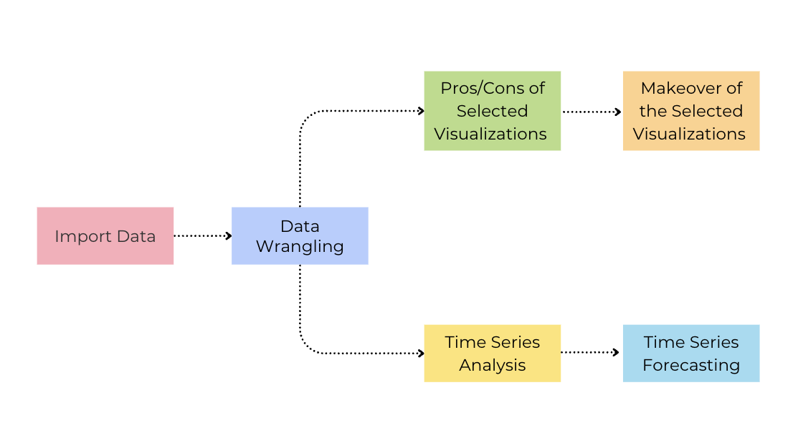
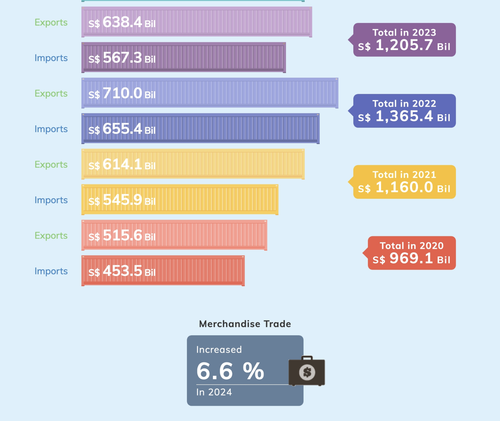
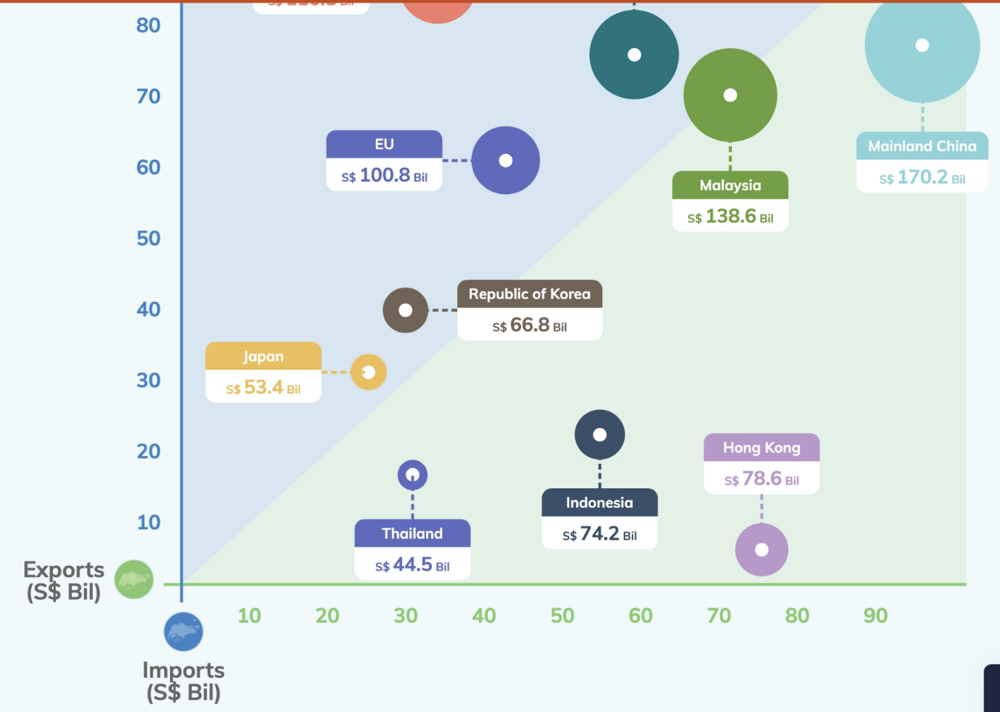
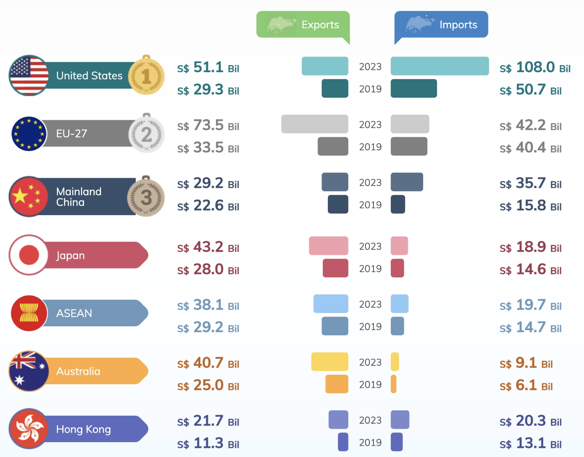
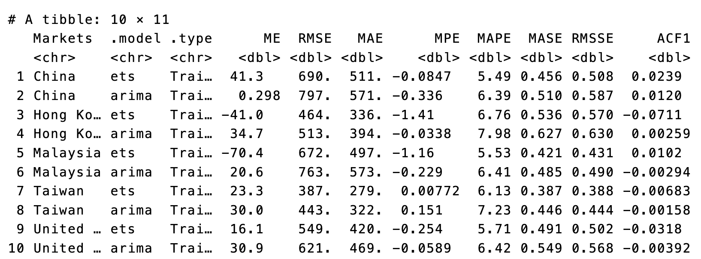

# 1 Overview

## 1.1 Background

Since Donald Trump assumed the U.S. presidency on January 20, 2025, global trade has been a focal point of economic discussions. Singapore, as a highly open economy, is deeply affected by shifts in international trade policies and global economic trends. Understanding how Singapore’s merchandise trade has evolved since 2003 provides valuable insights into the country’s trade resilience, shifting market dependencies, and economic positioning.

This study focuses on leveraging visual analytics and time-series techniques to explore Singapore’s international trade data. By analyzing historical trade patterns, identifying trends, and applying forecasting methods, this study aims to generate actionable insights into Singapore’s trade performance over the past decade.

## 1.2 Objectives

The primary objectives of this study are:

1.  To select three existing data visualizations from the dataset’s [webpage](#0), critically evaluate their effectiveness(with pros and cons) and propose and recreate improved visual representations.

2.  To implement time-series techniques to analyze trends in Singapore’s merchandise trade and use historical data to forecast for the next year. Derive meaningful conclusions from the visualizations, explaining key trade trends, shifts in trade regions, and potential implications for Singapore’s economy.

------------------------------------------------------------------------

# 2 Methodology & R Packages Used

We will follow the outlined methodology flow for this study, starting with data import and data wrangling, and discussion and makeover of selected visualizations and time series analysis.

{fig-align="center" width="669"}

::: panel-tabset
## Packages Used

| Package | Explanation |
|---------------------|---------------------------------------------------|
| tidyverse | to efficiently manipulate and clean data, utilizing functions from packages like `dplyr` and `tidyr` for data wrangling |
| readxl | allows us to import and work with excel file |
| lubridate | for working with dates and times, making it easier to manipulate and extract components like years, months, and days from date values. |
| ggplot2 | to create informative and aesthetically pleasing visualizations, such as histograms and boxplots, to analyze the data |
| patchwork | to combine multiple ggplot2 plots into a cohesive layout, making it easier to present related visualizations side by side |
| SmartEDA | to help summarize dataset by providing insights such as missing values |
| plotly | for creating interactive visualizations like zoom, and hover. |
| ggHoriPlot | for creating horizon plots, which are useful for visualizing deviations over time in a compact format. |
| CGPfunctions | contains functions to create slope graphs |
| viridis | offers colorblind-friendly color palettes for visualizations |
| ggthemes | Provides additional themes and styles for ggplot2 |
| tsibble | for manipulating time series data in a tidy format |
| feasts | to calculate a variety of summary statistics and transformations that help in analyzing time series data for forecasting |
| fable | for time series forecasting and for model evaluation and forecast visualization. |
| rsample | for splitting data into training and test set |
| modeltime | for time series modeling and forecasting that works with tidymodels. |
| prophet | for forecasting time series data with strong seasonal effects and multiple seasonality with irregular time series data |
| tidymodels | for machine learning and modeling in R. It provides a consistent framework for building, tuning, and evaluating models |

## Code to Launch

```{r}
pacman::p_load(tidyverse,readxl,lubridate,SmartEDA,patchwork,plotly,ggHoriPlot,CGPfunctions,viridis,ggthemes,tsibble,feasts,fable,rsample,modeltime,tidymodels)
```
:::

------------------------------------------------------------------------

# 3 The Dataset

The dataset, **Merchandise Trade by Region/Market**, is obtained from the Department of Statistics Singapore (DOS) and provides detailed records of Singapore’s international trade. It consists of three Excel tabs: *Imports, Domestic Exports, and Re-Exports*, capturing monthly trade values (in million SGD) with various countries from January 2003 to January 2025. This dataset enables an in-depth analysis of Singapore’s trade flows, helping to identify key trading partners, shifting trade patterns, and trends in import and export activities over time.

------------------------------------------------------------------------

# 4 Data Preparation

## 4.1 Importing the Data and Removing Irrelevant Rows

The code chunk below imports *MerchanciseTrade.xlsx* as three dataframes - imports, exports and reexports- into R environment by using *read_xlsx( )* from **readxl** package. "sheet =" tells which worksheet to read as our dataset contains multiple worksheets.

The Excel sheets also contain irrelevant rows, including data descriptions and footnotes, which need to be removed as we import. Specifically:

-   **Rows 1 to 9** contain metadata and are not part of the actual dataset.

-   **Row 10** contains column headers and should be set as variable names.

-   **Rows 171 to 191** contain footnotes and other non-relevant information that should be excluded.

To ensure a clean dataset, we will remove these rows and set Row 10 as the header.

::: panel-tabset
## Imports

```{r}
imports <- read_xlsx("data/MerchandiseTrade.xlsx", sheet = "T1",skip = 9) %>%
  slice(1:161)
colnames(imports) <- as.character(imports[1, ])  # Assign first row as column names
imports <- imports[-1, ]
```

## Exports

```{r}
exports <- read_xlsx("data/MerchandiseTrade.xlsx", sheet = "T2",skip = 9) %>%
  slice(1:161)
colnames(exports) <- as.character(exports[1, ])  # Assign first row as column names
exports <- exports[-1, ]
```

## Re-Exports

```{r}
reexports <- read_xlsx("data/MerchandiseTrade.xlsx", sheet = "T3",skip = 9) %>%
  slice(1:161)
colnames(reexports) <- as.character(reexports[1, ])  # Assign first row as column names
reexports <- reexports[-1, ]
```
:::

## 4.2 Checking for Missing values

The *ExpData* from **SmartEDA** package provides a quick overview of data types and missing values.

::: panel-tabset
## Imports

```{r}
imports %>%
  ExpData(type=1)
```

## Exports

```{r}
exports %>%
  ExpData(type=1)
```

## Reexports

```{r}
reexports %>%
  ExpData(type=1)
```
:::

Based on the results, all three data frames contain 100% complete cases, indicating the absence of missing values.

## 4.3 Renaming Columns and Converting Data Type

Initially, all variables in the dataset are stored as character data types. However, since all columns (except for Data Series) represent trade values in millions of SGD, they should be converted to numeric format. Additionally, we will rename the Data Series column to Markets for better readability.

The column names represent dates in the **"YYYY MMM"** format (e.g., `"2025 Jan"`, `"2024 Dec"`). To analyze the data effectively as a **time series**, we will need to :

1.  **Reshape the dataset from wide to long format** – Instead of having separate columns for each month, we will structure the data so that each row represents a month and its corresponding trade value. A long format is particularly beneficial when working with **ggplot2** because it simplifies faceting and makes data manipulation and visualization more flexible.

2.  **Convert the date column to a proper date format (`YYYY-MM`)** – Lubridating ensures consistency and compatibility with time series analysis and visualization.

::: panel-tabset
## Imports

```{r}
imports <- imports %>%
  rename(Markets = `Data Series`) %>% 
  mutate(across(-Markets, as.numeric)) %>%
  pivot_longer(cols = -Markets, names_to = "Date", values_to = "Trade_Value")%>%
  mutate(Date = parse_date_time(Date, orders = "ym"))%>%
  mutate(Date = as.Date(Date)) %>%
  arrange(Date)

head(imports)
```

## Exports

```{r}
exports <- exports %>%
  rename(Markets = `Data Series`) %>% 
  mutate(across(-Markets, as.numeric))%>%
  pivot_longer(cols = -Markets, names_to = "Date", values_to = "Trade_Value")%>%
  mutate(Date = parse_date_time(Date, orders = "ym"))%>%
  mutate(Date = as.Date(Date)) %>%
  arrange(Date)
```

## Reexports

```{r}
reexports <- reexports %>%
  rename(Markets = `Data Series`) %>% 
  mutate(across(-Markets, as.numeric))%>%
  pivot_longer(cols = -Markets, names_to = "Date", values_to = "Trade_Value")%>%
  mutate(Date = parse_date_time(Date, orders = "ym"))%>%
  mutate(Date = as.Date(Date)) %>%
  arrange(Date)
```
:::

## 4.4 Grouping Region or Country

The dataset contains rows that represent regions (e.g., "Total All Market", "America", "Asia", "Oceania", "Europe", and "Africa") alongside rows for individual countries. To facilitate analysis, we will add a new column (*RegionorCountry*) to classify each row as either a **region** or a **country**.

This classification allows us to easily filter out the region rows from analyses focused on country-level data, such as when creating visualizations or performing modeling tasks.

If we choose to exclude the region rows for specific analyses, we can filter them out using the newly created column, keeping only the country data for detailed exploration.

::: panel-tabset
## Imports

```{r}
# Adding new coulumn 
imports <- imports %>%
  mutate(RegionorCountry = ifelse(Markets %in% c("Total All Markets", "America", "Asia", "Oceania", "Europe", "Africa"), 
                                    "Region", "Country"))

head(imports)
```

## Exports

```{r}
# Adding new coulumn 
exports <- exports %>%
  mutate(RegionorCountry = ifelse(Markets %in% c("Total All Markets", "America", "Asia", "Oceania", "Europe", "Africa"), 
                                    "Region", "Country"))
```

## Reexports

```{r}
# Adding new coulumn 
reexports <- reexports %>%
  mutate(RegionorCountry = ifelse(Markets %in% c("Total All Markets", "America", "Asia", "Oceania", "Europe", "Africa"), 
                                    "Region", "Country"))
```
:::

## 4.5 Combining into One Dataframe

After all our data preparation, we can combine the three newly prepared datasets into a single unified dataframe. This step allows us to work with the data as a whole while preserving the distinction between the different trade categories. To achieve this, we use the `bind_rows()` function to stack the datasets and add a new column, `Type`, which indicates whether a row corresponds to Imports, Exports, or Re-Exports.

This combined dataframe will be more convenient for analysis, as it enables us to analyze trade data across different categories while keeping the data structured.

```{r}
imports <- imports %>%
  mutate(Type = "Import")

exports <- exports %>%
  mutate(Type = "Export")

reexports <- reexports %>%
  mutate(Type = "Re-Export")

# Combine all three datasets using bind_rows()
trade <- bind_rows(imports, exports, reexports)

head(trade)
```

Now, we can proceed to extract a subset of the dataframe on country-level data by excluding the regions.

```{r}
# Filter only countries (exclude regions)
country <- trade %>% filter(RegionorCountry == "Country")
```

For our time series analysis, we will prepare the data by converting the Date column into YearMonth format, which allows us to aggregate the total trade values for each month.

```{r}
country_tsibble <- country %>%
  mutate(Month = yearmonth(Date)) %>%  # Convert Date to YearMonth format
  as_tsibble(index = Month, key = c(Markets, Type)) 

```

------------------------------------------------------------------------

# 5 Three Visualizations & Their Makeovers

## 5.1 Visualization 1: Barchart of **Total Merchandise Trade, 2020 - 2024**

{fig-align="center" width="731"}

The barchart presents the total merchandise trade for the years 2020 through 2024, with each year showing two bars—representing export and import values. There are bubbles beside the bars indicating the combined total trade value for each year. A textbox also notes a 6.6% increase in trade in 2024.

### 5.1.1 Pros and Cons

**Pros:**

-   The color coding by year makes it easier to distinguish between the different years, providing clarity at a glance.

-   Clear trade value labels in each bar help viewers quickly identify the trade volume for both exports and imports.

-   The inclusion of total trade values beside each year simplifies interpretation and avoids requiring viewers to manually sum exports and imports.

**Cons:**

-   While the bar chart shows year-by-year comparisons, it does not explicitly illustrate trends over time.

-   The textbox stating "Increased 6.6% in 2024" is not effectively supported by the barchart itself. The viewer is left wondering what exactly increased and from which point the 6.6% growth is being measured (compared to 2023 or from the beginning of 2020).

-   The description does not explicitly explain that "exports" include "re-exports," which could lead to confusion for viewers since exports are higher than imports every year.

-   The total trade value for each year is not immediately clear, as it is displayed separately in a bubble, which might make it harder for viewers to correlate the textbox value with the corresponding bars.

-   The use of container shaped bars might look aesthetically appealing but adds unnecessary visual elements that do not enhance data interpretation.

### 5.1.2 Makeover

To improve the visualization, several changes were made:

-   A line chart was added alongside the bar chart to show percentage changes in trade over the years, providing context to fluctuations. This highlights trends, such as the recovery from a sharp decline in 2023 (-11.7%), emphasizing that the 6.6% increase in 2024 is part of a broader recovery.

-   The linechart also displays the total trade value on top of the bars to make it easy to follow.

-   A footnote was added to clarify that "exports include re-exports." This is an important piece of information that was missing in the original description, and its inclusion ensures the viewer has a complete understanding of what is meant by "exports" and why it might be higher than imports.

::: panel-tabset
## The Plot

```{r}
#| echo: False
#| fig-width: 12
#| fig_height: 30

country <- country %>%
  mutate(Year = format(as.Date(Date), "%Y"),
         Month = factor(month(Date), levels = 1:12))

# Calculate total trade value for export, import, and re-export (from 2019 to 2024)
summary_data <- country %>%
  filter(Type %in% c("Export", "Import", "Re-Export"), Year %in% c("2019", "2020", "2021", "2022", "2023", "2024")) %>%
  mutate(Trade_Value = as.numeric(Trade_Value)) %>%
  mutate(Type = ifelse(Type == "Re-Export", "Export", Type)) %>%
  group_by(Year, Type) %>%
  summarise(Total_Trade_Value = sum(Trade_Value, na.rm = TRUE)) %>%
  mutate(Total_Trade_Value_Billions = Total_Trade_Value / 1000,  # Convert to billions
         Label = paste0("$", round(Total_Trade_Value_Billions, 1))) 

# Calculate the total trade value for Export, Import, and Re-Export combined for each year
total_trade_by_year <- summary_data %>%
  group_by(Year) %>%
  summarise(Total_Trade_Value_Billions = sum(Total_Trade_Value_Billions, na.rm = TRUE))

# Get the 2019 total trade value for calculating the 2020 percentage change
total_trade_2019_value <- total_trade_by_year$Total_Trade_Value_Billions[total_trade_by_year$Year == "2019"]

# Calculate percentage change, keeping 2019 for reference
total_trade_by_year <- total_trade_by_year %>%
  mutate(Percentage_Change = (Total_Trade_Value_Billions / lag(Total_Trade_Value_Billions) - 1) * 100)

# Manually compute the 2020 percentage change using 2019's value
total_trade_by_year[total_trade_by_year$Year == "2020", "Percentage_Change"] <- 
  (total_trade_by_year$Total_Trade_Value_Billions[total_trade_by_year$Year == "2020"] - total_trade_2019_value) / total_trade_2019_value * 100

# Remove 2019 from the dataset to only plot 2020-2024
total_trade_by_year <- total_trade_by_year %>%
  filter(Year >= 2020)

summary_data <- summary_data %>%
  filter(Year >= 2020)

summary_data$Year <- as.integer(summary_data$Year)
total_trade_by_year$Year <- as.integer(total_trade_by_year$Year)

# Define limits for both axes
ylim.prim <- c(0, max(summary_data$Total_Trade_Value_Billions, na.rm = TRUE))
ylim.sec <- c(-50, 25)

# Transformation coefficients for scaling percentage change
b <- diff(ylim.prim) / diff(ylim.sec)
a <- ylim.prim[1] - b * ylim.sec[1] 


ggplot() +
  # Bar chart for Total Trade Value in Billions
  geom_bar(data = summary_data, aes(x = Year, y = Total_Trade_Value_Billions, fill = Type),
           stat = "identity", position = "dodge") +
  
  # Line chart for Percentage Change, scaled appropriately
  geom_line(data = total_trade_by_year, aes(x = Year, y = a + Percentage_Change * b), 
            color = "#e79251", size = 1) +
  geom_point(data = total_trade_by_year, aes(x = Year, y = a + Percentage_Change * b), 
             color = "#e79251", size = 3) + 
  
  # Add labels for the bar chart
  geom_text(data = summary_data, aes(x = Year, y = 0, label = Label, group = Type),
            position = position_dodge(width = 0.9), color= "#737373", vjust = -4, size = 5) +
  
  # Label the line chart with percentage values
  geom_text(data = total_trade_by_year, aes(x = Year, y = a + Percentage_Change * b, 
                                             label = paste0(round(Percentage_Change, 1), "%")), 
            color = "black", vjust = -0.5, size = 5) +
  
  # Add a red dotted line at 0% percentage change
  geom_hline(yintercept = a, color = "#ff9c07", linetype = "dotted", size = 1) +
  
  # Add total value labels on the line chart
  geom_text(data = total_trade_by_year, aes(x = Year, y = a + Percentage_Change * b,
                                             label = paste0("$", round(Total_Trade_Value_Billions, 1), " bil")),
            color = "#004aad", vjust = 1.5, size = 5) +
  
  # Set the primary Y-axis (Total Trade Value) and secondary Y-axis (Percentage Change)
  scale_y_continuous(
    name = "Total Trade Value (in Billions)",
    sec.axis = sec_axis(~(. - a) / b, name = "Percentage Change (%)") 
  ) +
  scale_x_continuous("Year", breaks = 2020:2024) +
  
  # Customize the fill colors for Export and Import
  scale_fill_manual(values = c("Export" = "#b4ceff", "Import" = "#cfe7af")) +
  
  # Add title and axis labels
  labs(
    title = "Annual Exports and Imports with Percentage Change in Total Trade Value (2020-2024)",
    x = "Year",
    y = "Total Trade Value (in Billions)",
    caption = "*Note: Exports include Re-exports",
    subtitle = "Line chart shows total trade value"
  ) +
  theme_minimal() +
  
  # Adjust the size of the title and axis titles
  theme(
    plot.title = element_text(size = 18, face = "bold"),
    axis.title.x = element_text(size = 16, face = "bold"),
    axis.text.x = element_text(size = 12),
    axis.title.y = element_text(size = 16, face = "bold"),
    axis.text.y = element_text(size = 12),
    plot.margin = margin(t = 20, r = 10, b = 10, l = 10)
  )

```

## The Code

```{r}
#| eval: False
#| fig-width: 12
#| fig_height: 30

country <- country %>%
  mutate(Year = format(as.Date(Date), "%Y"),
         Month = factor(month(Date), levels = 1:12))

# Calculate total trade value for export, import, and re-export (from 2019 to 2024)
summary_data <- country %>%
  filter(Type %in% c("Export", "Import", "Re-Export"), Year %in% c("2019", "2020", "2021", "2022", "2023", "2024")) %>%
  mutate(Trade_Value = as.numeric(Trade_Value)) %>%
  mutate(Type = ifelse(Type == "Re-Export", "Export", Type)) %>%
  group_by(Year, Type) %>%
  summarise(Total_Trade_Value = sum(Trade_Value, na.rm = TRUE)) %>%
  mutate(Total_Trade_Value_Billions = Total_Trade_Value / 1000,  # Convert to billions
         Label = paste0("$", round(Total_Trade_Value_Billions, 1))) 

# Calculate the total trade value for Export, Import, and Re-Export combined for each year
total_trade_by_year <- summary_data %>%
  group_by(Year) %>%
  summarise(Total_Trade_Value_Billions = sum(Total_Trade_Value_Billions, na.rm = TRUE))

# Get the 2019 total trade value for calculating the 2020 percentage change
total_trade_2019_value <- total_trade_by_year$Total_Trade_Value_Billions[total_trade_by_year$Year == "2019"]

# Calculate percentage change, keeping 2019 for reference
total_trade_by_year <- total_trade_by_year %>%
  mutate(Percentage_Change = (Total_Trade_Value_Billions / lag(Total_Trade_Value_Billions) - 1) * 100)

# Manually compute the 2020 percentage change using 2019's value
total_trade_by_year[total_trade_by_year$Year == "2020", "Percentage_Change"] <- 
  (total_trade_by_year$Total_Trade_Value_Billions[total_trade_by_year$Year == "2020"] - total_trade_2019_value) / total_trade_2019_value * 100

# Remove 2019 from the dataset to only plot 2020-2024
total_trade_by_year <- total_trade_by_year %>%
  filter(Year >= 2020)

summary_data <- summary_data %>%
  filter(Year >= 2020)

summary_data$Year <- as.integer(summary_data$Year)
total_trade_by_year$Year <- as.integer(total_trade_by_year$Year)

# Define limits for both axes
ylim.prim <- c(0, max(summary_data$Total_Trade_Value_Billions, na.rm = TRUE))
ylim.sec <- c(-50, 25)

# Transformation coefficients for scaling percentage change
b <- diff(ylim.prim) / diff(ylim.sec)
a <- ylim.prim[1] - b * ylim.sec[1] 


ggplot() +
  # Bar chart for Total Trade Value in Billions
  geom_bar(data = summary_data, aes(x = Year, y = Total_Trade_Value_Billions, fill = Type),
           stat = "identity", position = "dodge") +
  
  # Line chart for Percentage Change, scaled appropriately
  geom_line(data = total_trade_by_year, aes(x = Year, y = a + Percentage_Change * b), 
            color = "#e79251", size = 1) +
  geom_point(data = total_trade_by_year, aes(x = Year, y = a + Percentage_Change * b), 
             color = "#e79251", size = 3) + 
  
  # Add labels for the bar chart
  geom_text(data = summary_data, aes(x = Year, y = 0, label = Label, group = Type),
            position = position_dodge(width = 0.9), color= "#737373", vjust = -4, size = 5) +
  
  # Label the line chart with percentage values
  geom_text(data = total_trade_by_year, aes(x = Year, y = a + Percentage_Change * b, 
                                             label = paste0(round(Percentage_Change, 1), "%")), 
            color = "black", vjust = -0.5, size = 5) +
  
  # Add a red dotted line at 0% percentage change
  geom_hline(yintercept = a, color = "#ff9c07", linetype = "dotted", size = 1) +
  
  # Add total value labels on the line chart
  geom_text(data = total_trade_by_year, aes(x = Year, y = a + Percentage_Change * b,
                                             label = paste0("$", round(Total_Trade_Value_Billions, 1), " bil")),
            color = "#004aad", vjust = 1.5, size = 5) +
  
  # Set the primary Y-axis (Total Trade Value) and secondary Y-axis (Percentage Change)
  scale_y_continuous(
    name = "Total Trade Value (in Billions)",
    sec.axis = sec_axis(~(. - a) / b, name = "Percentage Change (%)") 
  ) +
  scale_x_continuous("Year", breaks = 2020:2024) +
  
  # Customize the fill colors for Export and Import
  scale_fill_manual(values = c("Export" = "#b4ceff", "Import" = "#cfe7af")) +
  
  # Add title and axis labels
  labs(
    title = "Annual Exports and Imports with Percentage Change in Total Trade Value (2020-2024)",
    x = "Year",
    y = "Total Trade Value (in Billions)",
    caption = "*Note: Exports include Re-exports",
    subtitle = "Line chart shows total trade value"
  ) +
  theme_minimal() +
  
  # Adjust the size of the title and axis titles
  theme(
    plot.title = element_text(size = 18, face = "bold"),
    axis.title.x = element_text(size = 16, face = "bold"),
    axis.text.x = element_text(size = 12),
    axis.title.y = element_text(size = 16, face = "bold"),
    axis.text.y = element_text(size = 12),
    plot.margin = margin(t = 20, r = 10, b = 10, l = 10)
  )
```
:::

## 5.2 Visualization 2: Bubble Chart of **Merchandise Trade Performance with Major Trading Partners, 2024**

{fig-align="center" width="681"}

This bubble chart provides a visual comparison of Singapore’s exports and imports with its major trading partners in 2024. The x-axis represents total export values, while the y-axis represents total import values for each country. The size of each bubble corresponds to the total trade value, with larger bubbles indicating higher overall trade volume. Each bubble is labeled with the respective country name and total trade value.

A distinctive feature of this chart is its background, which is divided diagonally into two colors: blue and green. The blue section represents countries where Singapore’s exports exceed its imports, while the green section highlights countries where Singapore imports more than it exports.

### 5.2.1 Pros and Cons

**Pros:**

-   A clear distinction between trade surpluses and deficits is made using background colors, simplifying the identification of Singapore’s trade balance with each country.
-   Varying bubble sizes effectively represent the scale of total trade with each country, enabling quick assessments of trading partners' significance.
-   Using exports on the x-axis and imports on the y-axis provides an intuitive way to understand trade relationships. Countries positioned above the diagonal line represent a trade deficit (more imports), while those below indicate a trade surplus (more exports).

**Cons:**

-   The EU is represented as a single entity, making comparisons with individual countries difficult due to the aggregation of trade data from multiple member states.
-   The use of different bubble colors for each country does not carry any specific meaning, which can be misleading or add unnecessary complexity. 
-   The chart displays total trade value but doesn’t show exact export and import values immediately, requiring further interaction to access detailed information. Since Singapore is a major hub for re-exports, combining exports and re-exports might obscure insights into Singapore’s domestic trade strength.

### 5.2.2 Makeover

To improve the visualization, several modifications have been made.

-   The top 10 trading countries have been selected instead of using the EU as a single entity. This allows for a more consistent comparison between individual countries.

-   Instead of using background colors to distinguish trade surpluses and deficits, the bubble colors themselves now indicate whether Singapore exports more than it imports to the particular country (orange) or imports more than it exports (green). This change provides a clearer and more intuitive representation of the trade balance without relying on the background color.

-   Tooltip enhancements provide clearer data and engagement when hovering over a bubble. In addition to total trade value, the exact re-export, export and import values for each country are now displayed, making it easier to grasp the trade breakdown instantly.

::: panel-tabset
## The Plot

```{r}
#| echo: False
top_10_markets_2024 <- country %>%
  filter(Year == 2024) %>%
  group_by(Markets) %>%
  summarise(
    Total_Import_Value = sum(Trade_Value[Type == "Import"]),
    Total_ReandExport_Value = sum(Trade_Value[Type %in% c("Export", "Re-Export")]),
    Total_Export_Value = sum(Trade_Value[Type == "Export"]), 
    Total_ReExport_Value = sum(Trade_Value[Type == "Re-Export"]),
    Total_Trade_Value = Total_Import_Value + Total_Export_Value + Total_ReExport_Value
  ) %>%
  arrange(desc(Total_Trade_Value)) %>%
  head(10)%>%
  mutate(Markets = ifelse(Markets == "Korea, Rep Of", "South Korea", Markets))


# Create a new variable to color the bubbles
top_10_markets_2024$BubbleColor <- ifelse(top_10_markets_2024$Total_ReandExport_Value < top_10_markets_2024$Total_Import_Value, "Imports from
that country exceeds
exports to
that country", "Exports to
the country exceeds
imports from
that country")

# Bubble plot
p <- ggplot(top_10_markets_2024, aes(y = Total_Import_Value / 1000, 
                                x = Total_ReandExport_Value / 1000, 
                                size = Total_Trade_Value / 1000, 
                                label = Markets, 
                                text = paste(
    "Total Export to", Markets, ": S$", round(Total_Export_Value / 1000, 1), "Bil",
    "\nTotal Re-Export to", Markets, ": S$", round(Total_ReExport_Value / 1000, 1), "Bil",
    "\nTotal Import from", Markets, ": S$", round(Total_Import_Value / 1000, 1), "Bil",
    "\nTotal Trade Value: S$", round(Total_Trade_Value / 1000, 1), "Bil"
  ),
                                fill = BubbleColor)) +
  
  # Bubbles
  geom_point(alpha = 0.7, shape = 21, color = "black") +  
  geom_text(vjust = -1, size = 3) +  
  
  scale_fill_manual(values = c("Imports from
that country exceeds
exports to
that country" = "#9cc567", "Exports to
the country exceeds
imports from
that country" = "#e79251")) +  # Define colors
  scale_size_continuous(range = c(5, 30), 
                        name = "Total Trade Value (Billion $)", 
                        breaks = c(50, 100, 150), 
                        labels = c("50", "100", "150")) +  
  scale_x_continuous(limits = c(0, 100), 
                     breaks = seq(0, 100, by = 10), 
                     labels = paste(seq(0, 100, by = 10))) + 
  scale_y_continuous(limits = c(0, 100), 
                     breaks = seq(0, 100, by = 10), 
                     labels = paste(seq(0, 100, by = 10))) + 
  
  # Title and axis labels
  labs(title = "Top 10 Merchandise Trade Markets (2024)", 
       y = "Total Import Value (Billion $)", 
       x = "Total Export Value (Billion $)") +   
  theme_minimal() +
  
  # Removing legend
  guides(size = guide_none(), color = guide_none()) 

# Interactivity-Show Trade value on hover
ggplotly(p, tooltip = "text")


```

## The Code

```{r}
#| eval: False
top_10_markets_2024 <- country %>%
  filter(Year == 2024) %>%
  group_by(Markets) %>%
  summarise(
    Total_Import_Value = sum(Trade_Value[Type == "Import"]),
    Total_ReandExport_Value = sum(Trade_Value[Type %in% c("Export", "Re-Export")]),
    Total_Export_Value = sum(Trade_Value[Type == "Export"]), 
    Total_ReExport_Value = sum(Trade_Value[Type == "Re-Export"]),
    Total_Trade_Value = Total_Import_Value + Total_Export_Value + Total_ReExport_Value
  ) %>%
  arrange(desc(Total_Trade_Value)) %>%
  head(10)%>%
  mutate(Markets = ifelse(Markets == "Korea, Rep Of", "South Korea", Markets))


# Create a new variable to color the bubbles
top_10_markets_2024$BubbleColor <- ifelse(top_10_markets_2024$Total_ReandExport_Value < top_10_markets_2024$Total_Import_Value, "Imports from
that country exceeds
exports to
that country", "Exports to
the country exceeds
imports from
that country")

# Bubble plot
p <- ggplot(top_10_markets_2024, aes(y = Total_Import_Value / 1000, 
                                x = Total_ReandExport_Value / 1000, 
                                size = Total_Trade_Value / 1000, 
                                label = Markets, 
                                text = paste(
    "Total Export to", Markets, ": S$", round(Total_Export_Value / 1000, 1), "Bil",
    "\nTotal Re-Export to", Markets, ": S$", round(Total_ReExport_Value / 1000, 1), "Bil",
    "\nTotal Import from", Markets, ": S$", round(Total_Import_Value / 1000, 1), "Bil",
    "\nTotal Trade Value: S$", round(Total_Trade_Value / 1000, 1), "Bil"
  ),
                                fill = BubbleColor)) +
  
  # Bubbles
  geom_point(alpha = 0.7, shape = 21, color = "black") +  
  geom_text(vjust = -1, size = 3) +  
  
  scale_fill_manual(values = c("Imports from
that country exceeds
exports to
that country" = "#9cc567", "Exports to
the country exceeds
imports from
that country" = "#e79251")) +  # Define colors
  scale_size_continuous(range = c(5, 30), 
                        name = "Total Trade Value (Billion $)", 
                        breaks = c(50, 100, 150), 
                        labels = c("50", "100", "150")) +  
  scale_x_continuous(limits = c(0, 100), 
                     breaks = seq(0, 100, by = 10), 
                     labels = paste(seq(0, 100, by = 10))) + 
  scale_y_continuous(limits = c(0, 100), 
                     breaks = seq(0, 100, by = 10), 
                     labels = paste(seq(0, 100, by = 10))) + 
  
  # Title and axis labels
  labs(title = "Top 10 Merchandise Trade Markets (2024)", 
       y = "Total Import Value (Billion $)", 
       x = "Total Export Value (Billion $)") +   
  theme_minimal() +
  
  # Removing legend
  guides(size = guide_none(), color = guide_none()) 

# Interactivity-Show Trade value on hover
ggplotly(p, tooltip = "text")
```
:::

## 5.3 Visualization 3: Major Trading Partners, 2023

{fig-align="center" width="541"}

The chart displays a dual-bar comparison of trade data for the top 10 countries by total trade value. On the left side, it shows the sum of exports in 2023 compared to 2019 (including re-exports), while the right side shows the sum of imports in 2023 compared to 2019.

### 5.3.1 Pros and Cons

**Pros:**

-   The dual bar chart clearly contrasts exports and imports for each country, making it easy to identify shifts in trade patterns and allows for direct comparison of export and import trends over the two years for each of the leading trade partners

-   Color coordination among different country labels and bars helps in associating the country with the bars.

**Cons:**

-   Including the EU and ASEAN as entities, rather than individual countries, makes it difficult to compare them directly with other countries, as they represent regional groups rather than single trade partners.

-   The countries appear ranked by total trade value for 2023, but it’s not immediately clear.

-   The labels only appear far outside the bars making it hard to follow and there is a repetitive use of the labels "2023" and "2019".

### 5.3.2 Makeover

Several modifications have been made to improve the visualization and provide a clearer comparison.

-   Exports & Imports are placed side-by-side (not separated) to immediately shows if Singapore has a trade surplus or deficit with each major trade partner.

-   2023 data was replaced by 2024 data since it is most recent data and darker color to emphasize it.

-   Trading partners were sorted by overall Trade Growth percentage from 2019 to 2024 to shows which partners are increasing/decreasing in importance and added a small text at the top to explain this. Percentage growth labels (e.g., `+12%`, `-5%`) were also added beside bars to highlight changes. Now, it can be seen that South Korea has an increasing importance over the years with the highest growth in import.

-   Value labels are now inside of the bars for better readability at a glance.

::: panel-tabset
## The Plot

```{r}
#| echo: False
#| fig-width: 10

# find top 10 markets for 2019
top_10_markets_2019 <- country %>%
  mutate(Markets = ifelse(Markets == "Korea, Rep Of", "South Korea", Markets))%>%
  filter(Year == 2019, Markets %in% top_10_markets_2024$Markets) %>%
  group_by(Markets) %>%
  summarise(
    Total_Import_Value = sum(Trade_Value[Type == "Import"], na.rm = TRUE),
    Total_ReandExport_Value = sum(Trade_Value[Type %in% c("Export", "Re-export")], na.rm = TRUE),
    Total_Trade_Value = Total_Import_Value + Total_ReandExport_Value
  ) %>%
  arrange(match(Markets, top_10_markets_2024$Markets))

# Calculate percentage change
percentage_change <- top_10_markets_2024 %>%
  left_join(top_10_markets_2019, by = "Markets", suffix = c(".2024", ".2019")) %>%
  mutate(
    Import_Change = (Total_Import_Value.2024 - Total_Import_Value.2019) / Total_Import_Value.2019 * 100,
    Export_Change = (Total_ReandExport_Value.2024 - Total_ReandExport_Value.2019) / Total_ReandExport_Value.2019 * 100
  ) %>%
  select(Markets, Import_Change, Export_Change)

# Merge data
dual_chart_data <- bind_rows(
  top_10_markets_2019 %>%
    mutate(Year = "2019"),
  top_10_markets_2024 %>%
    mutate(Year = "2024")
) %>%
  pivot_longer(cols = c(Total_Import_Value, Total_ReandExport_Value),
               names_to = "Type", values_to = "Value") %>%
  mutate(Value = ifelse(Type == "Total_ReandExport_Value", -Value, Value),
         Type = ifelse(Type == "Total_Import_Value", "Imports", "Exports"))

dual_chart_data <- dual_chart_data %>%
  left_join(percentage_change, by = "Markets")


color_mapping <- c("Exports.2019" = "#cde7f0", "Exports.2024" = "#83bace",
                               "Imports.2019" = "#ffcccc", "Imports.2024" = "#f2677d")

ggplot(dual_chart_data, aes(x = reorder(Markets, Import_Change + Export_Change), y = Value, fill = interaction(Type, Year))) +
  geom_bar(stat = "identity", position = position_stack(reverse = TRUE), width = 0.7) +
  scale_y_continuous(labels = abs) +  # Keep labels positive
  labs(title = "Trade Value Comparison and Percentage Change (2019 vs 2024) for Top 10 Markets",
       subtitle = "Trading Partners Sorted from Highest to Lowest Overall Trade Growth % from 2019 to 2024",
       x = "Top 10 Trading Partners as of 2024", 
       y = "Trade Value (in Billions SGD)") +
  theme_minimal() +
  scale_fill_manual(values = color_mapping) +
  coord_flip() + 
  
  #Trade value labels for each bar
  geom_text(aes(label = ifelse(Type == "Exports", 
                             scales::comma(abs(Value) / 1000, accuracy = 0.1), 
                             scales::comma(Value / 1000, accuracy = 0.1))),  
          position = position_dodge(width = 0.6),
          size = 3, color = "black",
          hjust = ifelse(dual_chart_data$Year == "2024" & dual_chart_data$Type == "Exports", -0.5, 
                         ifelse(dual_chart_data$Year == "2019" & dual_chart_data$Type == "Exports", -0.1,
                                ifelse(dual_chart_data$Year == "2024" & dual_chart_data$Type == "Imports", -0.2, 
                                       1))),
          

          vjust = ifelse(dual_chart_data$Year == "2024" & dual_chart_data$Type == "Exports", 1, 
                         ifelse(dual_chart_data$Year == "2019" & dual_chart_data$Type == "Exports",-0.7,
                                ifelse(dual_chart_data$Year == "2024" & dual_chart_data$Type == "Imports", 2, 
                                       0.3))))+ 
  
  # Percentage Change label for Imports 
geom_text(data = dual_chart_data %>% filter(Type == "Imports" & Year == "2024") %>% 
            group_by(Markets) %>% 
            slice_tail(n = 1), 
          aes(label = ifelse(Import_Change >= 0, 
                             paste0("+", round(Import_Change, 1), "%"), 
                             paste0(round(Import_Change, 1), "%"))),
          hjust = -1.5,
          vjust = 0.5,   
          size = 5,
          color="#608e24",
          fontface = "bold") +  

# Percentage Change label for Exports 
geom_text(data = dual_chart_data %>% filter(Type == "Exports" & Year == "2024") %>% 
            group_by(Markets) %>% 
            slice_tail(n = 1),
          aes(
              label = ifelse(Export_Change >= 0, 
                             paste0("+", round(Export_Change, 1), "%"), 
                             paste0(round(Export_Change, 1), "%"))),
          hjust = 2,
          vjust = 0.5,   
          size = 5,
          color = "#608e24",
          fontface = "bold") +

  
  theme(plot.title = element_text(size = 14, face = "bold"),
        plot.subtitle = element_text(size = 10, face = "italic"),
        axis.text.x = element_blank())
```

## The Code

```{r}
#| eval: False
#| fig-width: 10

# find top 10 markets for 2019
top_10_markets_2019 <- country %>%
  mutate(Markets = ifelse(Markets == "Korea, Rep Of", "South Korea", Markets))%>%
  filter(Year == 2019, Markets %in% top_10_markets_2024$Markets) %>%
  group_by(Markets) %>%
  summarise(
    Total_Import_Value = sum(Trade_Value[Type == "Import"], na.rm = TRUE),
    Total_ReandExport_Value = sum(Trade_Value[Type %in% c("Export", "Re-export")], na.rm = TRUE),
    Total_Trade_Value = Total_Import_Value + Total_ReandExport_Value
  ) %>%
  arrange(match(Markets, top_10_markets_2024$Markets))

# Calculate percentage change
percentage_change <- top_10_markets_2024 %>%
  left_join(top_10_markets_2019, by = "Markets", suffix = c(".2024", ".2019")) %>%
  mutate(
    Import_Change = (Total_Import_Value.2024 - Total_Import_Value.2019) / Total_Import_Value.2019 * 100,
    Export_Change = (Total_ReandExport_Value.2024 - Total_ReandExport_Value.2019) / Total_ReandExport_Value.2019 * 100
  ) %>%
  select(Markets, Import_Change, Export_Change)

# Merge data
dual_chart_data <- bind_rows(
  top_10_markets_2019 %>%
    mutate(Year = "2019"),
  top_10_markets_2024 %>%
    mutate(Year = "2024")
) %>%
  pivot_longer(cols = c(Total_Import_Value, Total_ReandExport_Value),
               names_to = "Type", values_to = "Value") %>%
  mutate(Value = ifelse(Type == "Total_ReandExport_Value", -Value, Value),
         Type = ifelse(Type == "Total_Import_Value", "Imports", "Exports"))

dual_chart_data <- dual_chart_data %>%
  left_join(percentage_change, by = "Markets")


color_mapping <- c("Exports.2019" = "#cde7f0", "Exports.2024" = "#83bace",
                               "Imports.2019" = "#ffcccc", "Imports.2024" = "#f2677d")

ggplot(dual_chart_data, aes(x = reorder(Markets, Import_Change + Export_Change), y = Value, fill = interaction(Type, Year))) +
  geom_bar(stat = "identity", position = position_stack(reverse = TRUE), width = 0.7) +
  scale_y_continuous(labels = abs) +  # Keep labels positive
  labs(title = "Trade Value Comparison and Percentage Change (2019 vs 2024) for Top 10 Markets",
       subtitle = "Trading Partners Sorted from Highest to Lowest Overall Trade Growth % from 2019 to 2024",
       x = "Top 10 Trading Partners as of 2024", 
       y = "Trade Value (in Billions SGD)") +
  theme_minimal() +
  scale_fill_manual(values = color_mapping) +
  coord_flip() + 
  
  #Trade value labels for each bar
  geom_text(aes(label = ifelse(Type == "Exports", 
                             scales::comma(abs(Value) / 1000, accuracy = 0.1), 
                             scales::comma(Value / 1000, accuracy = 0.1))),  
          position = position_dodge(width = 0.6),
          size = 3, color = "black",
          hjust = ifelse(dual_chart_data$Year == "2024" & dual_chart_data$Type == "Exports", -0.5, 
                         ifelse(dual_chart_data$Year == "2019" & dual_chart_data$Type == "Exports", -0.1,
                                ifelse(dual_chart_data$Year == "2024" & dual_chart_data$Type == "Imports", -0.2, 
                                       1))),
          

          vjust = ifelse(dual_chart_data$Year == "2024" & dual_chart_data$Type == "Exports", 1, 
                         ifelse(dual_chart_data$Year == "2019" & dual_chart_data$Type == "Exports",-0.7,
                                ifelse(dual_chart_data$Year == "2024" & dual_chart_data$Type == "Imports", 2, 
                                       0.3))))+ 
  
  # Percentage Change label for Imports 
geom_text(data = dual_chart_data %>% filter(Type == "Imports" & Year == "2024") %>% 
            group_by(Markets) %>% 
            slice_tail(n = 1), 
          aes(label = ifelse(Import_Change >= 0, 
                             paste0("+", round(Import_Change, 1), "%"), 
                             paste0(round(Import_Change, 1), "%"))),
          hjust = -1.5,
          vjust = 0.5,   
          size = 5,
          color="#608e24",
          fontface = "bold") +  

# Percentage Change label for Exports 
geom_text(data = dual_chart_data %>% filter(Type == "Exports" & Year == "2024") %>% 
            group_by(Markets) %>% 
            slice_tail(n = 1),
          aes(
              label = ifelse(Export_Change >= 0, 
                             paste0("+", round(Export_Change, 1), "%"), 
                             paste0(round(Export_Change, 1), "%"))),
          hjust = 2,
          vjust = 0.5,   
          size = 5,
          color = "#608e24",
          fontface = "bold") +

  
  theme(plot.title = element_text(size = 14, face = "bold"),
        plot.subtitle = element_text(size = 10, face = "italic"),
        axis.text.x = element_blank())
```
:::

------------------------------------------------------------------------

# 6 Time Series Analysis

## 6.1 Long-Term Trends

### 6.1.1 Overview of Trade Trends

To gain insights into the overall trends of exports and imports to Singapore, we visualize the data using a line chart created with the `geom_line` function from the `ggplot2` package.

::: panel-tabset
## The Plot

```{r}
#| echo: False
#| fig-width: 10
# Summarize data for exports and imports, excluding 2025
trade_summary <- country %>%
  filter(Type %in% c("Export", "Import"), Year != 2025) %>%  # Exclude 2025
  group_by(Year) %>%
  summarise(
    TotalExport = sum(Trade_Value[Type == "Export"]/1000, na.rm = TRUE),  
    TotalImport = sum(Trade_Value[Type == "Import"]/1000, na.rm = TRUE)  
  ) %>%
  ungroup()

trade_summary$Year <- as.numeric(trade_summary$Year)

linetrade <- ggplot(trade_summary, aes(x = Year)) +
  # Export line
  geom_line(aes(y = TotalExport, color = "Total Exports"), size = 1) +
  # Import line
  geom_line(aes(y = TotalImport, color = "Total Imports"), size = 1) +
  labs(
    title = "Overview on Trade: Exports vs Imports",
    x = "Year",
    y = "Trade Value (Billions)",
    color = "Trade Type"
  ) +
  scale_color_manual(values = c("Total Exports" = "#83bace", "Total Imports" = "#f2677d")) +
  theme_minimal() +
  theme(legend.position = "none",
        axis.text.x = element_text(angle=45)) +
  scale_x_continuous(breaks = seq(min(trade_summary$Year), max(trade_summary$Year), by = 1))

# Add static text labels for Exports and Imports
linetrade <- linetrade + 
  geom_text(aes(x = max(trade_summary$Year), y = TotalExport, label = "Exports"), 
            data = trade_summary %>% filter(Year == max(Year)),
            color = "#83bace", vjust = -2, size = 3, fontface = "bold") +
  geom_text(aes(x = max(trade_summary$Year), y = TotalImport, label = "Imports"), 
            data = trade_summary %>% filter(Year == max(Year)),
            color = "#f2677d", vjust = -1.6, size = 3, fontface = "bold")

# Convert ggplot to interactive plotly object
interactive_plot <- ggplotly(linetrade, tooltip = c("x", "y"))

# Customize the tooltip text to show "Year: 2020, Total Imports: S$ 431.2 Bil"
interactive_plot <- interactive_plot %>%
  layout(
    hoverlabel = list(
      font = list(size = 12),
      bgcolor = "white"
    )
  )

interactive_plot %>%
  style(
    hovertemplate = paste("Year: %{x}<br>Total Imports: S$ %{y:.1f} Bil")
  )


```

## The Code

```{r}
#| eval: False
#| fig-width: 10
# Summarize data for exports and imports, excluding 2025
trade_summary <- country %>%
  filter(Type %in% c("Export", "Import"), Year != 2025) %>%  # Exclude 2025
  group_by(Year) %>%
  summarise(
    TotalExport = sum(Trade_Value[Type == "Export"]/1000, na.rm = TRUE),  
    TotalImport = sum(Trade_Value[Type == "Import"]/1000, na.rm = TRUE)  
  ) %>%
  ungroup()

trade_summary$Year <- as.numeric(trade_summary$Year)

linetrade <- ggplot(trade_summary, aes(x = Year)) +
  # Export line
  geom_line(aes(y = TotalExport, color = "Total Exports"), size = 1) +
  # Import line
  geom_line(aes(y = TotalImport, color = "Total Imports"), size = 1) +
  labs(
    title = "Trade Value: Exports vs Imports",
    x = "Year",
    y = "Trade Value (Billions)",
    color = "Trade Type"
  ) +
  scale_color_manual(values = c("Total Exports" = "#83bace", "Total Imports" = "#f2677d")) +
  theme_minimal() +
  theme(legend.position = "none") +
  scale_x_continuous(breaks = seq(min(trade_summary$Year), max(trade_summary$Year), by = 1))

# Add static text labels for Exports and Imports
linetrade <- linetrade + 
  geom_text(aes(x = max(trade_summary$Year), y = TotalExport, label = "Exports"), 
            data = trade_summary %>% filter(Year == max(Year)),
            color = "#83bace", vjust = -2, size = 3, fontface = "bold") +
  geom_text(aes(x = max(trade_summary$Year), y = TotalImport, label = "Imports"), 
            data = trade_summary %>% filter(Year == max(Year)),
            color = "#f2677d", vjust = -1.6, size = 3, fontface = "bold")

# Convert ggplot to interactive plotly object
interactive_plot <- ggplotly(linetrade, tooltip = c("x", "y"))

# Customize the tooltip text to show "Year: 2020, Total Imports: S$ 431.2 Bil"
interactive_plot <- interactive_plot %>%
  layout(
    hoverlabel = list(
      font = list(size = 12),
      bgcolor = "white"
    )
  )

interactive_plot %>%
  style(
    hovertemplate = paste("Year: %{x}<br>Total Imports: S$ %{y:.1f} Bil")
  )
```
:::

::: {.callout-note style="color: black; background-color: #e0f3f9"}
## Insights

-   Both imports and exports show an upward trend over the years, indicating overall trade growth. Imports consistently exceed exports across the entire period, reflecting a trade deficit. Singapore’s trade deficit is a result of its economic model rather than poor performance. It is a small, resource-scarce country with limited natural resources. As a result, it relies heavily on imports for essential goods like food, energy, and raw materials to sustain its economy.

<!-- -->

-   There is a sharp dip in both imports and exports around 2009, likely due to the Global Financial Crisis.After this drop, trade volumes rebounded quickly by 2010, showing resilience in Singapore’s trade sector.

-   After a dip in 2020, there is significant spike in imports observed around 2021–2022, likely due to pandemic recovery efforts and supply chain disruptions. However, exports did not rise as dramatically.
:::

### 6.1.2 Ranking Changes in Singapore’s Top 10 Trading Partners: The Slopegraph

To first understand the trend of the top 10 trading partners of Singapore from the start of the dataset (2003) to the current day, we will first visualize the slopegraph using **newggslopegraph** from **CGPfunctions**.

::: panel-tabset
## The Plot

```{r}
#| echo: False

country_filtered <- country %>%
  filter(Markets %in% top_10_markets_2024$Markets, Year != 2025) %>%
  mutate(Year = as.numeric(Year)) %>%
  group_by(Markets, Year) %>%  # Group by country and year
  summarise(Total_Trade_Value = sum(Trade_Value, na.rm = TRUE)) %>% 
  ungroup()

# Scale Total_Trade_Value by dividing by 1000 to show values in Billions
country_filtered <- country_filtered %>%
  mutate(Total_Trade_Value_Billions = Total_Trade_Value / 1000)

country_filtered %>% 
  mutate(Year = factor(Year)) %>%
  filter(Year %in% c(2003, 2024)) %>%
  newggslopegraph(Year, Total_Trade_Value_Billions, Markets,
                Title = "Total Trade Value of Top 10 Markets",
                SubTitle = "2003-2024")
```

## The Code

```{r}
#| eval: False
country_filtered <- country %>%
  filter(Markets %in% top_10_markets_2024$Markets, Year != 2025) %>%
  mutate(Year = as.numeric(Year)) %>%
  group_by(Markets, Year) %>%  # Group by country and year
  summarise(Total_Trade_Value = sum(Trade_Value, na.rm = TRUE)) %>% 
  ungroup()

# Scale Total_Trade_Value by dividing by 1000 to show values in Billions
country_filtered <- country_filtered %>%
  mutate(Total_Trade_Value_Billions = Total_Trade_Value / 1000)

country_filtered %>% 
  mutate(Year = factor(Year)) %>%
  filter(Year %in% c(2003, 2024)) %>%
  newggslopegraph(Year, Total_Trade_Value_Billions, Markets,
                Title = "Total Trade Value of Top 10 Markets",
                SubTitle = "2003-2024")
```
:::

::: {.callout-note style="color: black; background-color: #e0f3f9"}
## Insights

-   **China’s Dominance in Trade Growth:** In 2003, China ranked 4th. By 2024, it became Singapore’s largest trading partner at \$170.18 billion, showing the highest absolute growth among all countries.This reflects China’s rapid economic rise, stronger trade ties with ASEAN, and its role as a global manufacturing hub.

-   **Taiwan’s Growth:** Taiwan surged from 7th place in 2003 to 4th place in 2024. This suggests increasing trade ties.

-   **Japan’s Declining Relative Position:** Japan was 5th in 2003 but dropped to 7th place in 2024. Although Japan’s trade value increased, its growth rate was much slower than China, Taiwan, and Indonesia. This suggests a relative decline in Singapore’s dependence on Japan, possibly due to competition from other Asian economies.

-   **India’s Strong Growth but still a smaller partner:** India had the lowest trade value in 2003 but more than quadrupled to \$31.89 billioin by 2024. Despite strong growth, India remains the smallest of the top 10 markets, indicating untapped potential for further trade expansion.
:::

### 6.1.3 Yearly Trade Trends in Singapore’s Top 10 Trading Partners: The Line Chart

To capture fluctuations and economic shocks, showing how trade evolved dynamically rather than just at two points (2003 vs. 2024), we will visualize the trend further with a line chart using **geom_line** from ggplot2.

::: panel-tabset
## The Plot

```{r}
#| echo: False
#| fig-width: 10

ggplot(country_filtered, aes(x = Year, y = Total_Trade_Value_Billions, group = Markets, color = Markets)) +
  geom_line(size = 1) +
  geom_point(size = 2) +
  scale_x_continuous(breaks = seq(min(country_filtered$Year), max(country_filtered$Year), by = 2)) +
  scale_y_continuous(labels = scales::comma) +
  labs(title = "Total Trade Value of Top 10 Trading Partners Over Time",
       subtitle = "*Top 10 Trading Partners as of 2024",
       x = "Year",
       y = "Total Trade Value (in Billions SGD)") +
  theme_minimal() +
  theme(legend.position = "right",
        plot.title = element_text(size=12,face="bold"),
        plot.subtitle =element_text(size=8),
        axis.text.x = element_text(angle = 50, hjust = 1))
```

## The Code

```{r}
#| eval: False
#| fig-width: 10

# Plot the line chart
ggplot(country_filtered, aes(x = Year, y = Total_Trade_Value_Billions, group = Markets, color = Markets)) +
  geom_line(size = 1) +
  geom_point(size = 2) +
  scale_x_continuous(breaks = seq(min(country_filtered$Year), max(country_filtered$Year), by = 2)) +
  scale_y_continuous(labels = scales::comma) +
  labs(title = "Total Trade Value of Top 10 Trading Partners Over Time",
       subtitle = "*Top 10 Trading Partners as of 2024",
       x = "Year",
       y = "Total Trade Value (in Billions SGD)") +
  theme_minimal() +
  theme(legend.position = "right",
        plot.title = element_text(size=12,face="bold"),
        plot.subtitle =element_text(size=8),
        axis.text.x = element_text(angle = 50, hjust = 1))
```
:::

::: {.callout-note style="color: black; background-color: #e0f3f9"}
## Insights

-   **China’s Rapid Growth & Market Dominance:** China (red line) shows a steady upward trend, becoming the top trading partner by 2024. Significant growth occurs post 2018.

-   **Malaysia & the U.S. Retain Strong Positions:** Malaysia (blue line) had the highest trade value in the early 2000s but was surpassed by China after 2013. The U.S. (pink line) shows fluctuations but remains a top-tier trading partner, with a notable decline around 2009 (financial crisis) and recovery post 2020.

-   **Japan’s Decline:** Japan (dark green line) shows decline post-2012, reinforcing its reduced significance in Singapore’s trade network.
:::

**Comparison to the Slopegraph**

The line chart supports the slopegraph’s findings asboth visualizations confirm China’s dominance, Malaysia & the U.S. as steady top-tier partners, Taiwan’s surge, and Japan’s relative decline. The slopegraph highlights rank changes, while the line chart shows the exact trajectory over time.

**Unique to the Line Chart:** The financial crisis (2008-2009) and COVID-19 (2020) impacts are visible, while the slopegraph only reflects net change.

## 6.2 Impact of COVID Pandemic on Trade

The COVID-19 pandemic significantly disrupted global trade, affecting Singapore’s trading patterns from Feb 2020 to Apr 2022. To analyze the extent of this impact, we use a horizon graph with ***geom_horizon*** to visualize trade fluctuations across different countries. This helps highlight the severity and duration of trade disruptions during the pandemic.

::: panel-tabset
## The Plot

```{r}
#| echo: False
# Convert Date column to proper format and filter data for 2019-2024
country_horizongraph <- country %>%
  filter(Markets %in% top_10_markets_2024$Markets, 
         Date < "2025-01-01") %>% 
  mutate(Date = as.Date(paste0(Date, "-01")),  # Convert YYYY-MM to Date format
         Trade_Value = as.numeric(Trade_Value),
         Trade_Value_Billions = Trade_Value / 1000) %>% 
  group_by(Markets, Date) %>%
  summarise(Total_Trade_Value = sum(Trade_Value_Billions, na.rm = TRUE)) %>%
  ungroup()


# covid period for reference lines
covid_dates <- as.Date(c("2020-02-01", "2022-04-01")) 

# Horizon Graph 
ggplot(country_horizongraph) +
  geom_horizon(aes(x = Date, y = Total_Trade_Value), 
               origin = "midpoint", 
               horizonscale = 6) +  
  facet_grid(Markets ~ .) +  
  theme_few() +
  scale_fill_hcl(palette = 'RdBu') +
  theme(
    panel.spacing.y = unit(0, "lines"), 
    strip.text.y = element_text(size = 7, angle = 0, hjust = 0), 
    legend.position = 'none',
    axis.text.y = element_blank(),
    axis.text.x = element_text(size = 5, angle = 50, hjust = 1),  
    axis.title.y = element_blank(),
    axis.title.x = element_blank(),
    axis.ticks.y = element_blank(),
    panel.border = element_blank()
  ) +
  scale_x_date(expand = c(0, 0), date_breaks = "3 months", date_labels = "%b %y") +
  ggtitle('Trade Value Deviations Over Time for Top 10 Trading Partners') +
  labs(subtitle = "COVID-19 period (Feb 2020 - Apr 2022) is highlighted with dashed lines.",size=4) + 
  geom_vline(xintercept = covid_dates, color = "black", linetype = "dashed", alpha = 1.5)

```

## The Code

```{r}
#| eval: False
# Convert Date column to proper format and filter data for 2019-2024
country_horizongraph <- country %>%
  filter(Markets %in% top_10_markets_2024$Markets, 
         Date < "2025-01-01") %>% 
  mutate(Date = as.Date(paste0(Date, "-01")),  # Convert YYYY-MM to Date format
         Trade_Value = as.numeric(Trade_Value),
         Trade_Value_Billions = Trade_Value / 1000) %>% 
  group_by(Markets, Date) %>%
  summarise(Total_Trade_Value = sum(Trade_Value_Billions, na.rm = TRUE)) %>%
  ungroup()


# covid period for reference lines
covid_dates <- as.Date(c("2020-02-01", "2022-04-01")) 

# Horizon Graph 
ggplot(country_horizongraph) +
  geom_horizon(aes(x = Date, y = Total_Trade_Value), 
               origin = "midpoint", 
               horizonscale = 6) +  
  facet_grid(Markets ~ .) +  
  theme_few() +
  scale_fill_hcl(palette = 'RdBu') +
  theme(
    panel.spacing.y = unit(0, "lines"), 
    strip.text.y = element_text(size = 7, angle = 0, hjust = 0), 
    legend.position = 'none',
    axis.text.y = element_blank(),
    axis.text.x = element_text(size = 5, angle = 50, hjust = 1),  
    axis.title.y = element_blank(),
    axis.title.x = element_blank(),
    axis.ticks.y = element_blank(),
    panel.border = element_blank()
  ) +
  scale_x_date(expand = c(0, 0), date_breaks = "3 months", date_labels = "%b %y") +
  ggtitle('Trade Value Deviations Over Time for Top 10 Trading Partners') +
  labs(subtitle = "COVID-19 period (Feb 2020 - Apr 2022) is highlighted with dashed lines.",size=4) + 
  geom_vline(xintercept = covid_dates, color = "black", linetype = "dashed", alpha = 1.5)

```
:::

::: {.callout-note style="color: black; background-color: #e0f3f9"}
## Insights

-   **Trade Disruptions During COVID-19 (2020-2022)**

    -   A sharp drop in trade volume was noted across multiple countries during early 2020, reflecting the initial impact of the pandemic on global supply chains.

    -   India, Indonesia, Japan and Malaysia show particularly steep declines, suggesting stricter lockdown measures or disruptions in trade routes.

    -   China and the Hong Kong rebounded faster, possibly due to their quicker economic recovery and policy responses. The trade impact of COVID-19 was not uniform among the top 10 trading partners—some countries recovered faster.

-   **Post-Pandemic Recovery (2022-Present)**

    -   Around Apr 2022, there is a strong resurgence in trade activity, indicated by increasing intensity in the blue-shaded areas, aligning with Singapore’s lifting of major COVID-19 restrictions.

    -   The strong rebound post-pandemic suggests Singapore's trade ecosystem is resilient, bouncing back quickly after restrictions were lifted.
:::

## 6.3 Seasonality in Trade Volumes

Examining seasonal trends in trade volumes allows us to uncover cyclical patterns that shape economic policies and business strategies in Singapore. To detect these trends, we utilize a calendar heatmap and cycle plot, which provides a clear visualization of monthly trade fluctuations over the years.

::: panel-tabset
## Heat Map

```{r}
#| echo: False
#| fig-width: 10
country_seasonality <- country %>%
  mutate(Date = as.Date(paste0(Date, "-01")), 
         Year = year(Date), 
         Month = factor(month(Date), levels = 1:12)) %>%
  group_by(Year, Month) %>%
  summarise(Total_Trade = sum(Trade_Value, na.rm = TRUE) / 1000) %>%
  ungroup()

ggplot(country_seasonality, aes(x = Month, y = factor(Year), fill = Total_Trade)) +
  geom_tile(color = "white", size = 0.2) +
  scale_fill_viridis(name = "Trade Value (Billion SGD)", option = "C", labels = scales::number_format(accuracy = 0.1)) +
  theme_tufte(base_family = "Helvetica") +
  labs(title = "Trade Value by Year and Month",
       x = "Month", y = "Year") +
  theme(axis.ticks = element_blank(),
        plot.title = element_text(hjust = 0.5),
        legend.title = element_text(size = 10),
        legend.text = element_text(size = 8))

```

## Cycle Plot

```{r}
#| echo: False
country_tsibble_summed <- country_tsibble %>%
  summarise(Total_Trade = sum(Trade_Value, na.rm = TRUE)) %>%
  ungroup()

# Create the cycle plot for total trade by month
country_tsibble_summed %>%
  gg_subseries(Total_Trade)
```

## The Codes

```{r}
#| eval: False
#| fig-width: 10

#Heatmap
country_seasonality <- country %>%
  mutate(Date = as.Date(paste0(Date, "-01")), 
         Year = year(Date), 
         Month = factor(month(Date), levels = 1:12)) %>%
  group_by(Year, Month) %>%
  summarise(Total_Trade = sum(Trade_Value, na.rm = TRUE) / 1000) %>%
  ungroup()

ggplot(country_seasonality, aes(x = Month, y = factor(Year), fill = Total_Trade)) +
  geom_tile(color = "white", size = 0.2) +
  scale_fill_viridis(name = "Trade Value (Billion SGD)", option = "C", labels = scales::number_format(accuracy = 0.1)) +
  theme_tufte(base_family = "Helvetica") +
  labs(title = "Trade Value by Year and Month",
       x = "Month", y = "Year") +
  theme(axis.ticks = element_blank(),
        plot.title = element_text(hjust = 0.5),
        legend.title = element_text(size = 10),
        legend.text = element_text(size = 8))

#Cycle Plot
country_tsibble_summed <- country_tsibble %>%
  summarise(Total_Trade = sum(Trade_Value, na.rm = TRUE)) %>%
  ungroup()

# Create the cycle plot for total trade by month
country_tsibble_summed %>%
  gg_subseries(Total_Trade)

```
:::

::: {.callout-note style="color: black; background-color: #e0f3f9"}
## Insights

-   **Trade Growth Over Time:** Trade values increase consistently over the years, as indicated by the gradual shift from dark purple (low trade) in the early 2000s to yellow (high trade) in recent years. This aligns with the line chart’s trend.

-   **Sharp Trade Surges in Recent Years:** 2022 stands out with exceptionally high trade values, especially around mid-year (bright yellow region), confirming the post-pandemic economic rebound observed in the line chart.

-   **Economic Crises:** The 2009 period is darker among the earlier years, indicating a trade decline due to the Global Financial Crisis, which aligns with previous findings.

-   **Seasonal Trends in Trade:** While the overall trend is upward, the cycleplot does not show clear month-to-month variations. Some mid-year peaks (June–August) appear in the heatmap, but no strong seasonal pattern can be seen. From the cycleplot February has the lowest month-to-month variation possibly due to Chinese New Year holidays.
:::

**Comparison to Previous Findings**: The overall trade growth trend, disruptions during economic crises, and strong post-pandemic recovery align with findings from the line chart and slopegraph.

**New insights from the heatmap:**

-   2022 stands out as an exceptionally strong trade year, even more than 2023–2024.

-   Trade dips during economic shocks are more visible across all months, not just in annual summaries.

-   Although every month displays an increasing trend, February has lowest trade volume.

## 6.4 Time Series Decomposition

### 6.4.1 Autocorrelation in Time-Series

In this section, we will explore the autocorrelation structure of monthly total trade values. To do this, we will use the ACF (Autocorrelation Function) and PACF (Partial Autocorrelation Function) plots, which are crucial for understanding the temporal dependencies within the data. The ACF plot will help us identify repeating patterns or trends, while the PACF plot will reveal the direct relationships between observations at different time lags.

We will specifically focus on the top five largest trading partners, as we aim to determine whether differencing is necessary to achieve stationarity in the time series. This analysis will be conducted using the `ACF()` and `PACF()` functions from the `feasts` package, which are essential tools for identifying temporal patterns and guiding the subsequent modeling steps.

::: panel-tabset
## ACF

```{r}
#| echo: False
#calculate the total trade value for each market 
country_tsibble_summed <- country_tsibble %>%
  group_by(Markets) %>% 
  summarise(Total_Trade = sum(Trade_Value, na.rm = TRUE)) %>%
  ungroup()

country_tsibble_summed %>%
  filter(Markets == "China" |
         Markets == "Malaysia" |
         Markets == "United States" |
         Markets == "Taiwan" |
         Markets == "Hong Kong") %>%
  ACF(Total_Trade) %>%
  autoplot()
```

## PACF

```{r}
#| echo: False
country_tsibble_summed %>%
  filter(Markets == "China" |
         Markets == "Malaysia" |
         Markets == "United States" |
         Markets == "Taiwan" |
         Markets == "Hong Kong") %>%
  PACF(Total_Trade) %>%
  autoplot()
```
:::

::: {.callout-note style="color: black; background-color: #e0f3f9"}
## Insights

**ACF :** shows how the current trade volume is correlated with its past values (lags).

-   For Hong Kong and Malaysia, there is a high and slowly decaying autocorrelation, indicating strong seasonality or long-term persistence in the trade volume data.

-   The presence of seasonality in the trade data for all these countries is not obvious with the decaying autocorrelation.

**PACF:** identifies the lag length where the direct influence of the past values is significant.

-   China,Taiwan and the United States shows a strong first-lag partial autocorrelation, suggesting that the immediate previous month's trade volume heavily influences the current month's value.

-   All countries also shows a significant first-lag but much weaker for later lags.

-   There are inverse spikes at the 13th month lag statiscally significant for all countries except Taiwan.

Conclusion: Since the ACF remains high across many lags, the series is likely non-stationary and must apply differencing.
:::

### 6.4.2 **STL Diagnostics**

Next, we will perform Seasonal and Trend decomposition using Loess (STL) to better understand the underlying components of the total trade data for the top 5 markets. STL decomposition is a powerful tool for breaking down a time series into three key components: trend, seasonality, and residuals. By analyzing these components, we can gain deeper insights into the patterns driving the data and assess the stability of trends over time. We will use the STL( ) function from the **feasts** package for decomposition and autoplot() to visualize the results.

::: panel-tabset
## China

```{r}
#| echo: False
country_tsibble_summed %>%
  filter(`Markets` == "China") %>%
  model(stl = STL(Total_Trade)) %>%
  components() %>%
  autoplot()
```

## Malaysia

```{r}
#| echo: False
country_tsibble_summed %>%
  filter(`Markets` == "Malaysia") %>%
  model(stl = STL(Total_Trade)) %>%
  components() %>%
  autoplot()
```

## UnitedStates

```{r}
#| echo: False
country_tsibble_summed %>%
  filter(`Markets` == "United States") %>%
  model(stl = STL(Total_Trade)) %>%
  components() %>%
  autoplot()
```

## Taiwan

```{r}
#| echo: False
country_tsibble_summed %>%
  filter(`Markets` == "Taiwan") %>%
  model(stl = STL(Total_Trade)) %>%
  components() %>%
  autoplot()
```

## HongKong

```{r}
#| echo: False
country_tsibble_summed %>%
  filter(`Markets` == "Hong Kong") %>%
  model(stl = STL(Total_Trade)) %>%
  components() %>%
  autoplot()
```
:::

::: {.callout-note style="color: black; background-color: #e0f3f9"}
## Insights

-   The trend is not constant — it rises steadily over time with some fluctuations for all countries.

-   This means there is a long-term trend, which often signals non-stationarity. Therefore, there is a need for trend differencing.

-   Since seasonality remains stable over time, seasonal differencing is not necessary.

-   All of the remainder component looks like random noise, which is good.
:::

------------------------------------------------------------------------

# 7 Time-Series Forecasting

## 7.1 Overall Trade Forecast for 1 Year

In this section, we will use the **`modeltime`** package to generate an overall trade forecast for the next year. The `modeltime`package is particularly useful for this task because it integrates well with models like ETS, ARIMA, and Prophet, and allows for easy visualization of forecast results in an interactive and dynamic way.

### **Step 1: Data Sampling**

We prepare the dataset for forecasting by filtering and aggregating trade values. We calculate the total trade value by summing the individual trade categories on a monthly basis and convert the values to thousands. The data is then split into training and holdout sets using an initial time split with 95.5% of the data allocated to training and the rest to testing.

```{r}
total_summary <- country %>%
  filter(Type %in% c("Export", "Re-Export", "Import","Date")) %>%  
  group_by(Date) %>%
  summarise(
    Total = sum(Trade_Value[Type == "Export"]/1000 + 
                Trade_Value[Type == "Re-Export"]/1000 + 
                Trade_Value[Type == "Import"]/1000, 
                na.rm = TRUE)
  ) %>%
  ungroup()


splits <- total_summary %>%
  initial_time_split(prop = 0.955)
training <- training(splits)
holdout <- testing(splits)
```

### **Step 2: Create & Fit Multiple Models**

We develop and train three different forecasting models to predict future trade values-the ETS, Auto ARIMA, and Prophet models, each with its specific characteristics. We fit these models to the training dataset to assess their performance using fit() from rsample package.

**Model 1: Exponential Smoothing (Modeltime)**

An Error-Trend-Season (ETS) model by using `exp_smoothing()`.

```{r}
model_fit_ets <- exp_smoothing() %>%
    set_engine(engine = "ets") %>%
    fit(Total ~ `Date`, 
        data = training(splits))
```

**Model 2: Auto ARIMA (Modeltime)**

An auto ARIMA model by using `arima_reg()`.

```{r}
model_fit_arima <- arima_reg() %>%
  set_engine(engine = "auto_arima") %>%
  fit(Total ~ `Date`, 
      data = training(splits))
```

**Model 3: prophet (Modeltime)**

A prophet model using `prophet_reg()`.

```{r}
model_fit_prophet <- prophet_reg() %>%
  set_engine(engine = "prophet") %>%
  fit(Total ~ `Date`, 
      data = training(splits))
```

### **Step 3: Add fitted models to a Model Table**

After fitting the individual models, we consolidate them into a model table using the `modeltime_table` function from the modeltime package. This table serves as a central reference for all the models we’ve created.

```{r}
models_tbl <- modeltime_table(
  model_fit_ets,
  model_fit_arima,
  model_fit_prophet)

models_tbl
```

### **Step 4: Calibrate the model to the testing set**

Next, we calibrate the models using the testing set to assess their performance on unseen data. Calibration is essential to evaluate how well each model generalizes to new data. The calibration table provides a detailed summary of each model's performance, including metrics. This step helps to identify the model that performs best under test conditions.

```{r}
calibration_tbl <- models_tbl %>%
    modeltime_calibrate(new_data = testing(splits))

calibration_tbl
```

### **Step 5: Model Accuracy Assessment**

To quantify the performance of the models, we calculate various accuracy metrics. The modeltime_accuracy function evaluates these metrics for each model, providing insights into how well each model captures the underlying trade patterns. A table of accuracy metrics is generated for easy comparison, with the Prophet model emerging as the most accurate and consistent predictor of trade trends, outperforming both the ETS and ARIMA models.

```{r}
calibration_tbl %>%
  modeltime_accuracy %>%
  table_modeltime_accuracy(
    .interactive = FALSE)
```

-   **Prophet:** The Prophet model consistently achieves the lowest error rates across almost all metrics the highest R² (0.35). This suggests that the Prophet model captures the underlying trade patterns more effectively than the ETS and ARIMA models.

-   **ETS :** The ETS model performs better than ARIMA in most metrics. However, its R² (0.27) indicates that it explains less variance compared to Prophet.

-   **ARIMA:** The ARIMA model shows the highest error rates across all metrics, suggesting that ARIMA struggles to model the trade trend effectively, possibly due to the complex seasonality and non-linear patterns present in the dataset.

Let's visualize the accuracy on the testing set before we actually visualize the forecast from the models.

```{r}
calibration_tbl %>%
  modeltime_forecast(
    new_data = testing(splits),
    actual_data = total_summary) %>%
  plot_modeltime_forecast(
    .legend_max_width = 25, 
    .interactive = TRUE,
    .plotly_slider = TRUE)
```

::: {.callout-note style="color: black; background-color: #e0f3f9"}
## Insights

-   ETS (red line) predict a stable or slightly decreasing trend for the trade forecast with more flunctuations.The ARIMA and Prophet model shows a slightly increasing trend. Prophet model(yellow line) is the most aligned with the actual trade. It also has the narrowest confidence interval among the three, implying less uncertainty.
:::

### **Step 6: Refit to Full Dataset & Forecast Forward**

In this final step, we refit the best-performing models using the full dataset to improve forecast accuracy by leveraging all available data.

```{r}
refit_tbl <- calibration_tbl %>%
    modeltime_refit(data = total_summary)
```

Then, `modeltime_forecast()` is used to forecast to for 12 months.

```{r}
forecast_tbl <- refit_tbl %>%
  modeltime_forecast(
    h = "12 months",
    actual_data = total_summary,
    keep_data = TRUE) 
```

We plot the forecast using plot_modeltime_forecast(

```{r}
forecast_tbl %>%
  plot_modeltime_forecast(
    .legend_max_width = 25, 
    .interactive = TRUE,
    .plotly_slider = TRUE)
```

::: {.callout-note style="color: black; background-color: #e0f3f9"}
## Insights

-   **Overall Trend:** All three models predict a stable or slightly increasing trend for the trade forecast.The ETS model (red line) shows more fluctuations compared to Prophet and ARIMA, indicating that it is more sensitive to short-term variations.

-   **Confidence Intervals:** The Prophet model (yellow line) has the narrowest confidence intervals, suggesting higher certainty in its predictions. The ARIMA model (green line) shows the widest confidence intervals, reflecting higher uncertainty in its forecasts.

-   **Forecast Horizon:** The Prophet model maintains a steady stable trend. ETS shows a more volatile pattern with an upward trend, indicating that it captures short-term seasonality. ARIMA forecasts slightly downward movements, which may indicate that it is more affected by noise.
:::

```{r}
refit_tbl %>%
  modeltime_accuracy() %>%
  table_modeltime_accuracy(
    .interactive = FALSE)
```

The **Prophet model is the best performer** for forecasting Singapore's trade trend, balancing **both accuracy and consistency**.

## 7.2 Forecast for The Top 5 Trading Partners

For the forecast of the top 5 trading partners, we will use the **`fable`** package. The reason for using `fable` here is its strength in handling multiple time series data and its ability to efficiently forecast and compare the results for each major trading partner individually.

### Step 1: Differencing

We filter to focus on the top 5 countries: China, Malaysia, United States, Taiwan, and Hong Kong. Apply **first-order differencing** (d = 1) to remove the trend as found above.

```{r}
country_tsibble_summed <- country_tsibble_summed %>%
  mutate(Month = yearmonth(Month),  # Convert from yearmonth to Date format
         Date = as.Date(Month))

top5 <- country_tsibble_summed %>%
  filter(Markets == "China" |
         Markets == "Malaysia" |
         Markets == "United States" |
         Markets == "Taiwan" |
         Markets == "Hong Kong")

# First-order differencing
top5_diff <- top5 %>%
  mutate(Diff_Trade = difference(Total_Trade, lag = 1)) %>%  
  drop_na(Diff_Trade)  
```

### Step 2: Data Sampling

Divide the data into training and hold-out sets, splitting from February 2024. Then we create a new column, `trainorhold`, which categorizes each row as either "Training" or "Hold-out" based on whether the Date is before or after the cutoff. Afterward, we select only the rows labeled as "Training", which will be used to fit our forecasting models

```{r}
top5_train <- top5_diff %>%
  mutate(trainorhold = if_else(
    `Date` >= "2024-02-01", 
    "Hold-out", "Training")) %>%
  filter(trainorhold == "Training")
```

### Step 3: Fitting the Models

We fit two types of forecasting models on the training data:

-   **ETS (Exponential Smoothing State Space Model)**

-   **ARIMA (Auto-Regressive Integrated Moving Average)**

The model() function from the fable package is used to fit both models simultaneously on the Total_Trade variable.

```{r}
top5_fit <- top5_train %>%
  model(
    ets = ETS(Total_Trade),
    arima = ARIMA(Total_Trade)
  )
```

### Step 4: Summary of Fitted Models

The glance () function from fabletools provides a quick summary of the fitted models.

```{r}
top5_fit %>%
  glance()
```

For all five countries (China, Hong Kong, Malaysia, Taiwan, and the United States), the **ARIMA model** consistently outperforms the **ETS model** in terms of AIC, AICc, BIC, and log-likelihood. This suggests that ARIMA is a better fit for the total trade data for these countries, as it accounts for the autocorrelations and patterns in the data more effectively than ETS, especially considering the lower AIC and BIC values.

### Step 5: Model Diagnostics

The augment() function provides the original data along with the fitted values and residuals (the differences between the actual and predicted values). This is useful for diagnosing how well the model is performing. 

```{r}
top5_fit %>%
  augment()
```

### Step 6: Compare Performance of Models

We will compare the performances of the two models with metrics such as RMSE, MAE, MAPE and ACF1.



The ETS model generally exhibits lower Mean Absolute Error (MAE) and Root Mean Square Error (RMSE) compared to the ARIMA model in most markets, suggesting that ETS provides more accurate point forecasts. However, ARIMA tends to yield lower Mean Percentage Error and higher Autocorrelation at Lag 1 across markets like China, Hong Kong, and the United States, which may indicate better handling of trend and seasonality components in certain contexts. Notably, Taiwan shows the smallest performance gap between the two models, implying that both methods offer comparable results in this market.

### Step 7: Forecast future values for 18 months

```{r}
top5_fc <- top5_fit %>%
  forecast(h = "18 months")
```

### Step 8: Plot the forecast

In the code chunk below `autoplot()` of feasts package is used to plot the raw and fitted values.

```{r}
#| fig_height: 10
# Filter and plot from January 2023 onwards
top5 <- top5 %>%
  filter(Month >= as.Date("2023-01-01"))

top5_fc %>%
  autoplot(top5)
```

::: {.callout-note style="color: black; background-color: #e0f3f9"}
## Insights

-   **China**: The ARIMA and ETS models show diverging forecasts, with ARIMA projecting a more stable trade value, while ETS forecasts a gradual upward trend. The actual trade value in recent months appears to fluctuate, indicating volatility.

-   **Hong Kong**: Both ARIMA and ETS models predict relatively stable trade volumes.The forecast intervals for ETS are narrower than ARIMA, suggesting ETS might fit the recent data trend better. Recent actual trade values align more closely with the ETS projections.

-   **Malaysia**: Trade values exhibit fluctuations in recent months, making forecasting more uncertain.The ETS model suggests a mild upward trend, while ARIMA forecasts more stable values.The wide prediction intervals for both models imply high uncertainty.

-   **Taiwan**:Both models project stable trade, while the actual trade values follow an upward trajectory. There is a huge gap with the models' forecast with the actual which might be due to external factors the models did not catch.

-   **United States**: Both ARIMA and ETS model shows stable trend and a slight downward trend in the recent months. This align with the actual decreasing trend in the recent months for USA.

-   **Overall**: The ETS model tends to align better with the actual trade patterns in China, Hong Kong and Malaysia. ARIMA forecasts are more conservative, projecting stable or slightly fluctuating trade values. In the future months, both models predict to have a slight dip and then recovery to a stable trajectory for all top trading partners.
:::

------------------------------------------------------------------------

# 8 Conclusion

Singapore’s trade has seen some shifts over the past two decades. China has solidified its dominance, Malaysia and the U.S. remain major partners, Taiwan’s role has expanded, while Japan’s influence has declined. The COVID-19 pandemic caused temporary disruptions, but a strong post-pandemic recovery followed. While trade volumes have grown steadily, clear seasonal patterns were not found. The forecast for 2025 suggests that Singapore’s total trade volume (both export and import) is likely to continue its upward trajectory,reflecting the country's economic resilience. However, the ARIMA model and ETS models' forecast for most of the top trading partners, reflects more or less stable trajectory.
